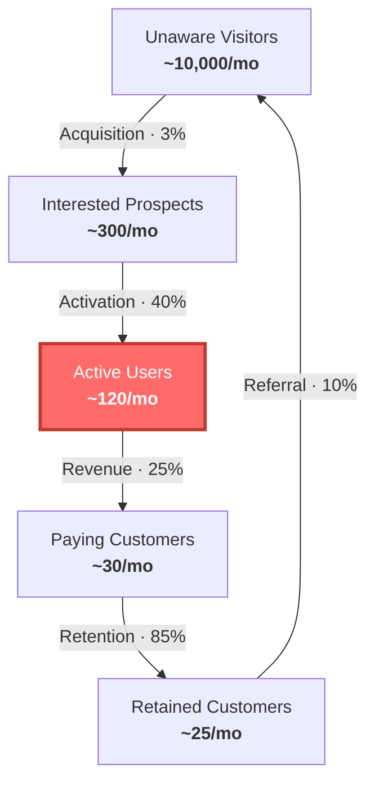

# Factory Floor

[](https://www.npmjs.com/package/@swiftner/factory-floor)

A [Claude Code](https://docs.anthropic.com/en/docs/claude-code) skill that asks you the right questions before you build the wrong thing.

## What this is

Factory Floor gives Claude Code a set of frameworks for thinking through startup decisions — so instead of giving you generic advice, it asks the specific questions that expose your blind spots.

You say "should we build Slack integration?" and instead of getting a pros-and-cons list, you get:

- *"Do you have paying customers? How many?"*
- *"What's your retention like — do people who try it stay?"*
- *"Where are new trials coming from? Is that number growing?"*
- *"If retention is 90% but trials are flat... is the real problem that not enough people know you exist?"*
- *"Would Slack integration bring you new customers who wouldn't have found you otherwise — or is it a feature for people who already use you?"*

You do the thinking. The frameworks make sure you're thinking about the right things.

## The frameworks

Four lenses, each with its own set of questions:

- **[Jobs To Be Done](references/jtbd.md)** — What job is the customer hiring you to do? What are the forces behind every deal — what pushes them to switch, what pulls them toward you, what makes them anxious, what keeps them stuck? Comes with interview protocols, a 5-minute post-conversation canvas, and opportunity scoring.
- **[Theory of Constraints](references/pillar-goldratt.md)** — Where is your one bottleneck right now? Are you feeding it or starving it? Is your team finishing things or juggling too many? Comes with a triage, a subordination matrix, Drum-Buffer-Rope, and WIP discipline.
- **[Customer Factory](references/pillar-maurya.md)** — Which step in Acquisition → Activation → Revenue → Retention → Referral is broken? What does "exploiting" look like at your stage? Comes with the GOLEAN sprint cycle, the napkin test, the Mafia Offer, and stage-based constraint mapping.
- **[Mental & Physical Availability](references/pillar-sharp.md)** — Do enough people know you exist? Can they find and try you? Are you distinctive enough to be remembered? Comes with a CEP mapping exercise, a physical availability audit, and an operational cadence for building awareness.

Plus [estimation frameworks](references/estimation.md) for when you need to think honestly about timelines — Critical Chain, buffer management, and why your gut estimate is probably wrong.

## Stage-routed guidance

The skill adapts to where you are. After a quick triage, it loads the right playbook:

- **[Pre-revenue](stages/pre-revenue.md)** — No paying customers yet? Focus on problem validation, not building. The five tests (not-not, job, Lean Canvas, napkin, Mafia Offer), JTBD basics, a solo-founder weekly review, and a worked example of killing a bad idea before writing code.
- **[Growth](stages/growth.md)** — Have customers, team under ~10? Find the constraint, exploit it, run the system. Full constraint cascade, GOLEAN sprints, WIP discipline, estimation, and two worked examples — a growth stall and a constraint shift.
- **[Scaling](stages/scaling.md)** — $1M+ ARR, 10+ people? The constraint is often a policy, not a funnel step. Policy constraints, multi-team coordination, hiring as elevation, multi-quarter initiatives, and a worked example of a hidden policy constraint.

## Customer factory funnel

The one diagram that matters. Shows your five macro steps with conversion rates, constraint highlighted red.



Renders to SVG via [beautiful-mermaid](https://github.com/lukilabs/beautiful-mermaid) with a violet/indigo palette by default. Pass `--theme brand-light` for a white background variant.

## Install

```bash
npx @swiftner/factory-floor
```

That's it. Installs the skill to `~/.claude/skills/factory-floor/` and sets up the diagram renderer.

The skill triggers automatically when you ask Claude Code about prioritisation, bottlenecks, weekly reviews, or what to work on next.

## Structure

```
factory-floor/
├── SKILL.md                          # Router — triage, stage routing, anti-patterns, vocabulary
├── stages/
│   ├── pre-revenue.md                # Day 1 → first paying customer
│   ├── growth.md                     # Post-revenue → ~$1M ARR
│   └── scaling.md                    # $1M+ ARR, 10+ people
├── references/
│   ├── pillar-goldratt.md            # Theory of Constraints deep-dive
│   ├── pillar-maurya.md              # Customer Factory deep-dive
│   ├── pillar-sharp.md               # Mental & Physical Availability deep-dive
│   ├── jtbd.md                       # Jobs To Be Done — forces, interviews, job mapping
│   ├── estimation.md                 # Critical Chain estimation, buffer management, fever chart
│   └── weekly-diagrams.md            # Customer Factory Funnel diagram template
└── scripts/
    ├── render-diagram.mjs            # Renders .mmd → SVG via beautiful-mermaid
    └── package.json                  # Declares beautiful-mermaid dependency
```

`SKILL.md` is the entry point — a thin router (~200 lines) that runs the triage and loads the right stage file. Stage files are self-contained playbooks with worked examples. Reference files hold the deep-dive theory, loaded only when more detail is needed.

## Things you can say

> "What should we work on this week?"

Asks about your numbers, your team, what shipped last week. Helps you find the bottleneck and decide — not decide for you.

> "We have no customers yet, where do we start?"

Walks you through problem validation before you write code. Are you solving a real problem? Can the math work? Would someone commit to the offer?

> "Should we build this feature or focus on sales?"

Doesn't answer the question — asks you to think about where your constraint actually is, and whether the feature serves it or distracts from it.

> "We're spread too thin"

Helps you figure out what to stop. Asks about your WIP, your team state, what's actually moving the number that matters.

> "Why do deals ghost?"

Walks through the four forces with you. What's pushing them to switch? What's pulling them toward you? What's making them anxious? Where is the deal actually dying?

> "Help me prep for our weekly review"

Runs you through the review structure: name the constraint, check the numbers, look at where work is piling up, make focus decisions.

> "How long will this take?"

Doesn't give you a number. Helps you think about why estimates fail, walks you through focused vs. safe estimates, and helps you build an honest buffer.

## The weekly review

Scales to your stage and team size:

- **Pre-revenue** (solo or tiny team): 10 minutes. How many conversations? What did we learn? Has the hypothesis survived?
- **Growth** (1-5 people): 10 minutes. Name the constraint, check throughput, find the pile, set 3 priorities.
- **Scaling** (5+ people): 25 minutes. Same four phases plus funnel diagram, buffer/flow check, traffic lights on initiatives.

## Credits

The frameworks come from:

- **Clayton Christensen** — *The Innovator's Dilemma* (1997), *Competing Against Luck* (2016). Jobs To Be Done.
- **Bob Moesta** — *Demand-Side Sales 101* (2020). Forces of progress, switch interviews.
- **Tony Ulwick** — *Jobs to be Done: Theory to Practice* (2016). Outcome-Driven Innovation.
- **Eli Goldratt** — *The Goal* (1984), *Critical Chain* (1997). Theory of Constraints.
- **Ash Maurya** — *Running Lean* (2022), *Scaling Lean* (2016). Customer Factory, Lean Canvas, Mafia Offer.
- **Byron Sharp** — *How Brands Grow* (2010). Mental and physical availability.
- **April Dunford** — *Obviously Awesome* (2019). Positioning from JTBD.

---

Made by [Swiftner](https://swiftner.com).
