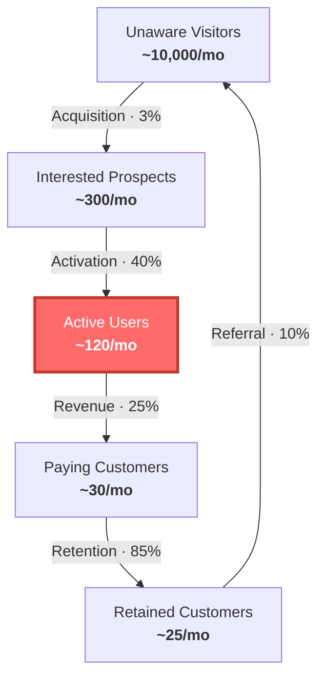

# Factory Floor

[](https://www.npmjs.com/package/@swiftner/factory-floor)

A [Claude Code](https://docs.anthropic.com/en/docs/claude-code) skill that turns your startup into a well-run factory. One constraint at a time.

## The idea

Your startup is a system. Like any system, it has exactly one bottleneck at any moment — one thing that limits how fast you create happy customers. Everything you do either serves that bottleneck or wastes time.

Factory Floor combines three frameworks into a single operating system:

| Framework | What it answers |
|---|---|
| **Goldratt's Theory of Constraints** | Where is the bottleneck? |
| **Maurya's Customer Factory** | Which step in the customer journey is it stuck at? |
| **Sharp's How Brands Grow** | Is the real problem that nobody knows we exist? |

The skill helps you identify your constraint, exploit it with existing resources, subordinate everything else to it, and only then invest in elevating it.

## What it does

- **Prioritisation** — "What should we work on?" becomes "What serves the constraint?" Everything else waits.
- **Weekly constraint review** — A scalable operating rhythm: 10-minute light review for small teams, 25-minute full review with a funnel diagram for larger ones.
- **Backlog decisions** — Every feature, hire, and initiative evaluated against the current constraint.
- **Anti-pattern detection** — Spots when you're optimising a non-constraint ("Let's keep everyone busy") or building features when the real problem is acquisition.

## Customer factory funnel

The one diagram that matters. Shows your five macro steps with conversion rates, constraint highlighted red.



Renders to SVG via [beautiful-mermaid](https://github.com/lukilabs/beautiful-mermaid) with a violet/indigo palette by default. Pass `--theme brand-light` for a white background variant.

## Install

```bash
npx @swiftner/factory-floor
```

That's it. Installs the skill to `~/.claude/skills/factory-floor/` and sets up the diagram renderer.

The skill triggers automatically when you ask Claude Code about prioritisation, bottlenecks, weekly reviews, or what to work on next.

## Structure

```
factory-floor/
├── SKILL.md                          # Main skill — loaded when triggered
├── references/
│   ├── pillar-goldratt.md            # Theory of Constraints deep-dive
│   ├── pillar-maurya.md              # Customer Factory deep-dive
│   ├── pillar-sharp.md               # Mental & Physical Availability deep-dive
│   ├── tool-setup.md                 # Asana, Linear, Notion, Trello configs
│   └── weekly-diagrams.md            # Customer Factory Funnel diagram template
└── scripts/
    ├── render-diagram.mjs            # Renders .mmd → SVG via beautiful-mermaid
    └── package.json                  # Declares beautiful-mermaid dependency
```

`SKILL.md` is the entry point. It contains the synthesised framework and decision process. The reference files are loaded by Claude only when deeper context is needed — keeping the context window lean.

## Usage examples

> "What should we work on this week?"

Claude identifies your current constraint in the customer factory and recommends work that serves it. Everything else gets explicitly deprioritised.

> "Help me prep for our weekly review"

Claude gathers your metrics, generates a funnel diagram, and walks through the review format: name the constraint, check throughput, assess buffer and flow, make focus decisions.

> "We're spread too thin"

Claude diagnoses WIP overload, applies Little's Law and Weinberg's context-switching tax, and recommends what to stop.

> "Should we build this feature or focus on sales?"

Claude evaluates both options against the current constraint. If acquisition is the bottleneck, the feature waits.

## The weekly review

Scales to your team size. Same four phases either way:

1. **Name the constraint** — Say it out loud. Has it shifted?
2. **Throughput check** — What moved? What didn't? Why?
3. **Where's the pile?** — Is the constraint fed? Where is work accumulating?
4. **Focus decisions** — Top 3 priorities. What are we explicitly *not* doing?

**Light version** (1-5 people): 10 minutes, no diagrams, standing up. **Full version** (5+): 25 minutes with a funnel diagram.

## Credits

Built on the work of:

- **Eli Goldratt** — *The Goal* (1984). Theory of Constraints.
- **Ash Maurya** — *Scaling Lean* (2016). Customer Factory.
- **Byron Sharp** — *How Brands Grow* (2010). Mental and physical availability.

---

Made by [Swiftner](https://swiftner.com).
