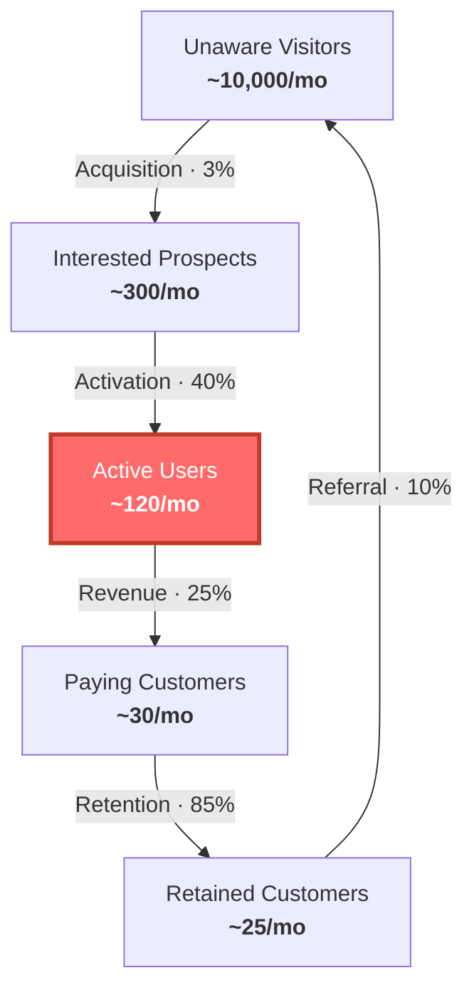
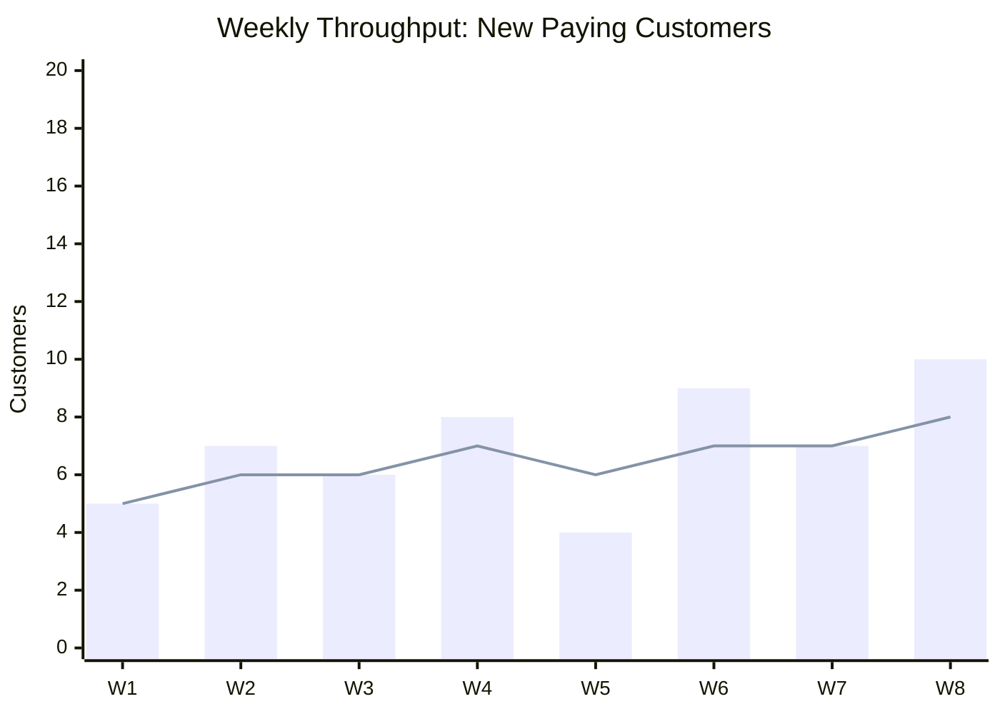
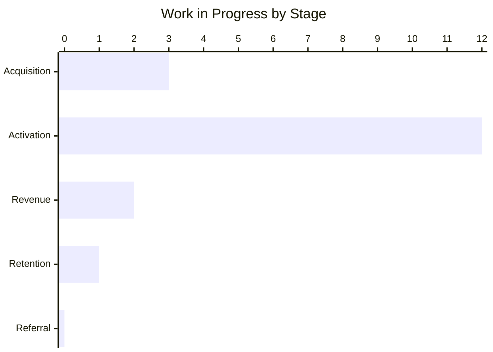
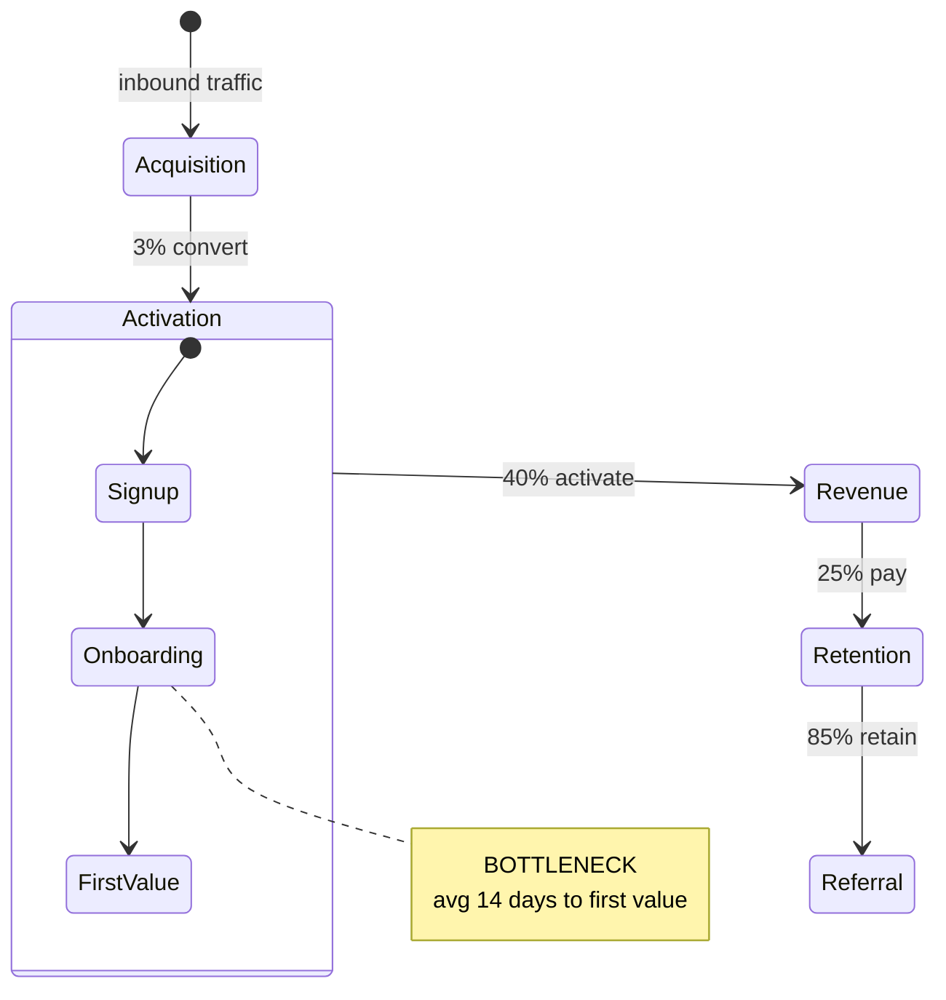

# Weekly Review Diagrams

Generate these diagrams during weekly constraint review preparation. Write each
diagram as a `.mmd` file, then render with `scripts/render-diagram.mjs`.

## 1. Customer Factory Funnel

Visualize the five macro steps with conversion rates. Highlight the constraint
step with `:::constraint` class styling.



**Rules:**
- Replace numbers with the startup's actual (or estimated) metrics.
- Apply the red highlight (`fill:#ff6b6b,stroke:#c0392b,stroke-width:3px,color:#fff`) to the node representing the current constraint.
- If the constraint is between steps (a conversion rate), highlight both adjacent nodes.
- Add a note below identifying the constraint in plain language.

## 2. Throughput Trend

Show weekly throughput (happy paying customers created) over the last 4-8 weeks.
Include a trendline to make direction visible at a glance.



**Rules:**
- X-axis: use week labels (W1, W2...) or date labels (Mar 3, Mar 10...).
- Bar = actual throughput per week. Line = rolling average or target.
- If the startup tracks a different primary throughput metric (e.g., activations, demos completed), use that instead.

## 3. WIP Snapshot

Show how much work is sitting at each stage. The tallest bar reveals
where inventory is accumulating — the empirical constraint.



**Rules:**
- Count open items/tasks/deals at each stage.
- The stage with the most WIP is likely the constraint (or feeding one).
- If using a project management tool, pull counts from board columns.

## 4. Constraint Flow State

Show where work flows freely vs. where it's stuck, using a state diagram.



**Rules:**
- Expand the constraint step into sub-states to show where inside it work stalls.
- Add a note marking the specific bottleneck within the constraint.
- Keep non-constraint steps as single nodes — don't expand what isn't the focus.

## Rendering

Install dependencies once:
```bash
cd scripts && npm install
```

Render any diagram:
```bash
node scripts/render-diagram.mjs funnel.mmd funnel.svg
node scripts/render-diagram.mjs throughput.mmd throughput.svg --theme brand-light
```

**Brand themes (default):**
- `brand-dark` — dark palette (violet/indigo). Used by default when no `--theme` flag is given.
- `brand-light` — white background with violet accents. Use for docs, slides, or sharing externally.

**Other themes:** `zinc-dark`, `tokyo-night`, `catppuccin-mocha`, `nord`, `dracula`,
`github-dark`, `zinc-light`, `tokyo-night-light`, `catppuccin-latte`, `github-light`.

Generate all four diagrams and present them together during the weekly review.
