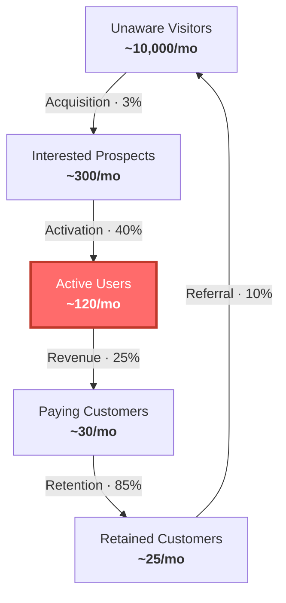

# Weekly Review

**Mindset:** not a status meeting, not a morale exercise. It exists to re-confirm or
move the constraint and leave with one clear priority. If everyone feels good and
nothing was named, it failed.

This is **PROCEDURE mode** — run the format, in order, directively. But take each
number *before* you comment on it. Their read first, then yours.

**Rules:** go in order · a missing number is recorded as unknown, never estimated ·
keep to the time budget.

**Always end with:** *"What is the one thing we will NOT do next week that we might
be tempted to do?"*

---

## Pre-revenue — 10 min

1. **Conversations (5).** How many real ones? What do you know now that you didn't
   on Monday? Anything surprise you?
2. **Hypothesis (3).** State it: *"[Customer] struggles with [problem] and will pay
   for [solution]."* Still believed? What moved it?
3. **One thing (2).** The single most important thing to **learn or test**. Not build.

## Growth — 10 min

1. **Constraint (2).** Name the step. Did it move — up, down, flat?
2. **Numbers (3).** Found ___ · Activated ___ · Paid ___ · Churned ___ · Biggest drop-off?
3. **Work pile (3).** What's in progress? Anything over 2 weeks — why? What shipped?
4. **Three priorities (2).** Only things serving the constraint. One named owner each.

## Scaling — 25 min

1. **Funnel snapshot (5).** Draw it, mark the biggest drop-off. Same as last week?
2. **Buffer and flow (5).** Where is work piling up? Where is capacity idle? Anything
   "almost done" for over 2 weeks?
3. **Traffic lights (10).** 🟢 on track · 🟡 at risk, needs attention this week ·
   🔴 stalled, consider killing.
4. **Policy scan (3).** Any rule that made sense 6 months ago and now slows things
   down? Usual culprits: approval chains, meeting load, hiring process, release gates.
5. **Focus (2).** One thing the team rallies around. What does done look like?

---

## Score last week's predictions

Every review, before anything else: **pull the open prediction from `context.md` and
score it.** Was the number right? How confident were they?

Quarterly, show the tally — 40–60% right is calibrated, over 70% means they're only
predicting safe things, under 30% means overconfident. Details →
`references/playbooks.md`.

This is the part that makes the rest work. Without it the founder is operating in an
environment that never tells them whether they were right.

---

## Funnel diagram

Write as `.mmd`, render with `scripts/render-diagram.mjs`.



Replace with their numbers. Highlight the constraint node in red; if the constraint
is a conversion rate, highlight both adjacent nodes. Add a line naming it in plain
language.

```bash
cd scripts && npm install          # once
node scripts/render-diagram.mjs funnel.mmd funnel.svg [--theme brand-light]
```

Themes: `brand-dark` (default), `brand-light`, `zinc-dark`, `tokyo-night`,
`catppuccin-mocha`, `nord`, `dracula`, `github-dark`, `zinc-light`,
`tokyo-night-light`, `catppuccin-latte`, `github-light`.
