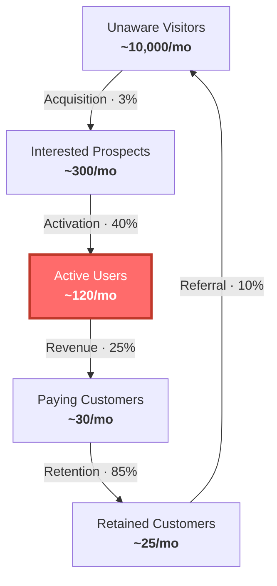

# Weekly Review

**Mindset:** not a status meeting, not a morale exercise. It exists to re-confirm or
move the constraint and leave with one clear priority. If everyone feels good and
nothing was named, it failed.

This is **PROCEDURE mode** — run the format, in order, directively. But take each
number *before* you comment on it. Their read first, then yours.

**Rules:** go in order · a missing number is recorded as unknown, never estimated ·
keep to the time budget.

**Always end with:** *"What is the one thing we will NOT do next week that we might
be tempted to do?"*

---

**Step 1 is always the same:** pull the open prediction from `## Current experiment`
and score it before discussing anything else. Ask for their number first, then read
out what they predicted. Without this the founder is working in an environment that
never tells them whether they were right — which is the whole reason the journal
exists.

## Pre-revenue — 12 min

1. **Score the prediction (2).** What did you expect? What happened?
2. **Conversations (5).** How many real ones? What do you know now that you didn't
   on Monday? Anything surprise you?
3. **Hypothesis (3).** State it: *"[Customer] struggles with [problem] and will pay
   for [solution]."* Still believed? What moved it?
4. **One thing (2).** The single most important thing to **learn or test**. Not build.

## Growth — 12 min

1. **Score the prediction (2).** What did you expect? What happened?
2. **Constraint (2).** Name the step. Did it move — up, down, flat?
3. **Numbers (3).** Found ___ · Activated ___ · Paid ___ · Churned ___ · Biggest drop-off?
4. **Work pile (3).** What's in progress? Anything over 2 weeks — why? What shipped?
5. **Three priorities (2).** Only things serving the constraint. One named owner each.

## Scaling — 25 min

1. **Score the prediction (3).** What did you expect? What happened?
2. **Funnel snapshot (5).** Draw it, mark the biggest drop-off. Same as last week?
3. **Buffer and flow (5).** Where is work piling up? Where is capacity idle? Anything
   "almost done" for over 2 weeks?
4. **Traffic lights (8).** 🟢 on track · 🟡 at risk, needs attention this week ·
   🔴 stalled, consider killing.
5. **Policy scan (2).** Any rule that made sense 6 months ago and now slows things
   down? Usual culprits: approval chains, meeting load, hiring process, release gates.
6. **Focus (2).** One thing the team rallies around. What does done look like?

The closing question is part of the final step — don't run over to fit it in, cut the
step short instead.

No open prediction (first review, or the last experiment was killed)? Skip step 1 and
say so, then make sure this review's experiment leaves with one.

Quarterly, show the tally — 40–60% right is calibrated, over 70% means they're only
predicting safe things, under 30% means overconfident. Details →
`references/playbooks.md`.

---

## Funnel diagram

Write as `.mmd`, render with `scripts/render-diagram.mjs`.



Replace with their numbers. Highlight the constraint node in red; if the constraint
is a conversion rate, highlight both adjacent nodes. Add a line naming it in plain
language.

Install the renderer once:

```bash
cd scripts && npm install
```

Then render from the repository root:

```bash
node scripts/render-diagram.mjs funnel.mmd funnel.svg
node scripts/render-diagram.mjs funnel.mmd funnel.svg --theme brand-light
```

Themes: `brand-dark` (default), `brand-light`, `zinc-dark`, `tokyo-night`,
`catppuccin-mocha`, `nord`, `dracula`, `github-dark`, `zinc-light`,
`tokyo-night-light`, `catppuccin-latte`, `github-light`.
