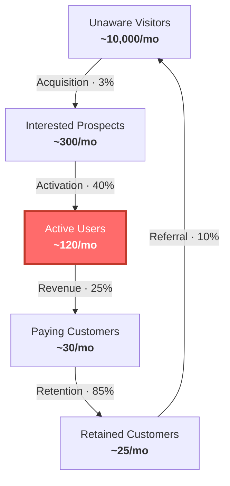

# Weekly Review

Load when the founder asks for a review, check-in, or wants to go over the week.
Run the format for their stage.

**The mindset:** this is not a status meeting and not a morale exercise. It exists
to re-confirm or move the constraint and to leave with one clear priority. If
everyone feels good and nothing was named, the review failed.

**Rules:** go in order, don't skip steps · a missing number is recorded as unknown,
never estimated · keep to the time budget.

**Always end with:** *"What is the one thing we will NOT do next week that we might
be tempted to do?"*

---

## Pre-revenue (10 min)

**1. Conversations (5 min)**
- How many real conversations with potential customers this week?
- What do you know now that you didn't on Monday?
- Did anything surprise you — good or bad?

**2. Hypothesis check (3 min)**
- State it in one sentence: *"[Customer] struggles with [problem] and will pay for [solution]."*
- Still believed? What evidence moved it forward or back?

**3. Next week's one thing (2 min)**
- The single most important thing to **learn or test**. Not build.

---

## Growth (10 min)

**1. Constraint (2 min)**
- Name it: acquisition / activation / revenue / retention / referral.
- Did it move? Throughput up, down, or flat?

**2. Numbers (3 min)**
- Found: ___ · Activated: ___ · Paid: ___ · Churned: ___
- Where's the biggest drop-off?

**3. Work pile (3 min)**
- What's in progress? List it.
- Anything in progress more than 2 weeks? Why?
- What actually shipped?

**4. Next week's 3 priorities (2 min)**
- Only things serving the constraint. One owner each, by name.

---

## Scaling (25 min)

**1. Funnel snapshot (5 min)**
Draw it: Awareness → Acquisition → Activation → Revenue → Retention. Mark the
biggest drop-off. Same as last week? (Diagram template below.)

**2. Buffer and flow (5 min)**
- Where is work piling up? Where is capacity idle?
- Anything "almost done" for more than 2 weeks?

**3. Initiative traffic lights (10 min)**
- 🟢 On track — constraint served, throughput moving
- 🟡 At risk — behind or blocked, needs attention this week
- 🔴 Stalled — consider pausing or killing

**4. Policy constraint scan (3 min)**
- Any rule, process, or habit that made sense 6 months ago and now slows things down?
- Usual culprits: approval chains, meeting load, hiring process, release gates.

**5. Next week's focus (2 min)**
- One thing the team rallies around. What does "done" look like?

---

## Funnel diagram (scaling review)

Write as a `.mmd` file, render with `scripts/render-diagram.mjs`.



- Replace the numbers with theirs — actual or estimated.
- Highlight the constraint node in red (`fill:#ff6b6b,stroke:#c0392b,stroke-width:3px,color:#fff`).
- Constraint is a conversion rate between steps? Highlight both adjacent nodes.
- Add a line below naming the constraint in plain language.

**Rendering** (once: `cd scripts && npm install`):

```bash
node scripts/render-diagram.mjs funnel.mmd funnel.svg
node scripts/render-diagram.mjs funnel.mmd funnel.svg --theme brand-light
```

Themes: `brand-dark` (default), `brand-light`, plus `zinc-dark`, `tokyo-night`,
`catppuccin-mocha`, `nord`, `dracula`, `github-dark`, `zinc-light`,
`tokyo-night-light`, `catppuccin-latte`, `github-light`.
